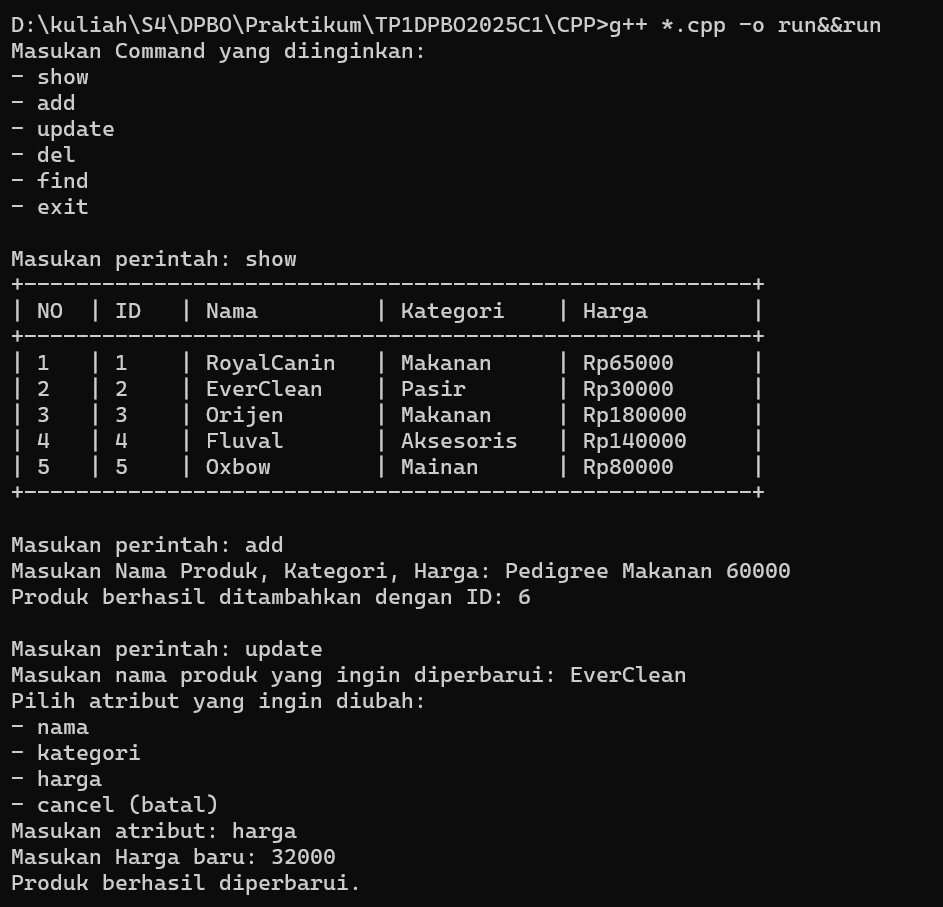

# Tugas Praktikum 1 - DPBO

## **Janji**
Saya, **Hafsah Hamidah** dengan NIM **2311474**, mengerjakan **Tugas Praktikum 1** dalam mata kuliah **DPBO** dengan sebaik-baiknya demi keberkahan-Nya.  
Saya berjanji tidak melakukan kecurangan sebagaimana yang telah dispesifikasikan. **Aamiin.**  

---

## **Deskripsi Program**  
Program ini memungkinkan pengguna untuk mengelola daftar produk di petshop.  
Produk yang dikelola memiliki atribut sebagai berikut:  
- **ID** (Nomor identitas unik produk)  
- **Nama** (Nama produk)  
- **Kategori** (Jenis produk, misalnya makanan, mainan, atau aksesoris)  
- **Harga** (Harga produk dalam rupiah)  

Pengguna dapat berinteraksi dengan program menggunakan beberapa perintah berikut:  

### **Perintah yang Tersedia**  
| Perintah  | Fungsi |
|-----------|--------|
| **show**  | Menampilkan daftar produk yang tersedia. |
| **add**   | Menambahkan produk baru ke dalam daftar. |
| **del**   | Menghapus produk berdasarkan nama. |
| **update**| Memperbarui atribut produk (nama, kategori, harga). |
| **find**  | Mencari produk berdasarkan nama. |
| **exit**  | Keluar dari program. |

Program akan terus berjalan sampai pengguna memasukkan perintah `exit` untuk keluar.  

---

## **Dokumentasi CPP**

---

## **Dokumentasi JAVA**

---

## **Dokumentasi PYTHON**

---

## **Dokumentasi PHP**
[Video Dokumentasi PHP](PHP/Dokumentasi/php1.mp4)

